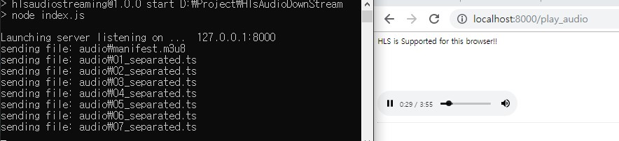
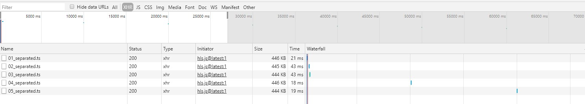

# HlsAudioDownstream

**HLS streaming from node** : Node.js Server that implements Audio Downstream using HLS protocol.

## Getting Started

왠만히 찾아본 hls 코드가 실행되지 않았다. 겨우겨우 찾은 되는 코드를 이용하여 Audio downstream 기능을 보완하였다.

### Prerequisites

For browsers that do not support HLS protocol, you must install the hls extension.

### Installing

Run in Window 10, chrome environment.

Install modules.

* http
* fs
* url
* path
* zlib

```shell
$npm install http fs url path zlib
```

## Running

check in `http://localhost:8000/`

```shell
$npm start
```

### Screenshot



Depending on the current playback situation, you can see that you are requesting the following file.



## Reference

* <https://gist.github.com/mharsch/5188206>

* <https://github.com/Einstrasse/hls-service/tree/394c7f3d33d687c91367c58f464e6f799292e40d>
